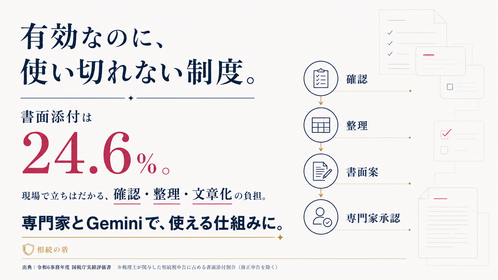
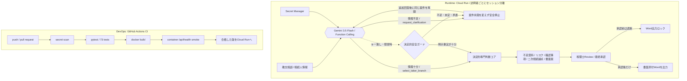
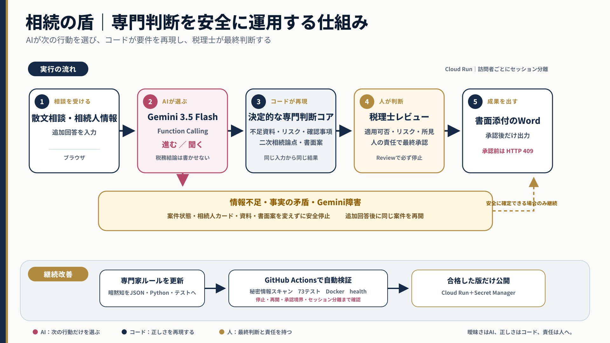

# 相続の盾

> **有効なのに、使い切れない制度。**<br>
> 書面添付は24.6％。<br>
> 現場で立ちはだかる、確認・整理・文章化の負担。<br>
> **専門家とGeminiで、使える仕組みに。**



[](https://github.com/souzoku-lab/souzoku-shield/actions/workflows/ci.yml)

- **Live Demo**: https://souzoku-agent-698253423667.asia-northeast1.run.app/
- **60秒デモ動画**: ProtoPedia作品ページに掲載（提出時にYouTube限定公開URLを追記）
- **ProtoPedia**: https://protopedia.net/prototype/8820
- **Hackathon**: [Findy DevOps × AI Agent Hackathon 2026](https://findy.notion.site/devops-ai-agent-hackathon-2026)

---

## 書面添付は、税理士関与の相続税申告でも24.6％

税理士法第33条の2に基づく書面添付制度は、申告内容の判断過程や確認事項を税務署へ伝えるための有効な制度です。

しかし令和6年度、税理士が関与した相続税申告に占める書面添付割合は**24.6％**。約4件に1件です。

制度が有効だと分かっていても、案件ごとに確認事項を洗い出し、資料と照合し、判断根拠を整理して文章化する負担が、実務での活用を難しくしています。

出典：[令和6事務年度 国税庁実績評価書](https://www.mof.go.jp/about_mof/policy_evaluation/nta/fy2024/evaluation/202510ntahyoka_mokuhyo16.pdf)<br>
※税理士が関与した相続税申告に占める割合。修正申告を除きます。

## 一つの見逃しが、課税価格を大きく変える

相続税では、一つの要件確認の見逃しが大きな影響につながります。

公開デモの架空ケースでは、家なき子の特例を適用できない場合、課税価格への影響は**＋5,600万円**です。

さらに相続専門家は、今回の申告だけでなく、配偶者へ財産を集めた後の**二次相続**まで見据えて検討します。

相続の盾は、こうした専門家の確認順序と先読みを、更新・検証できる仕組みにします。

相続税の「小規模宅地等の特例」は、**同じ自宅でも誰が取得するか・同居していたかで適用可否が変わり**、必要資料と確認の段取りも枝分かれします。相続の盾は、この取得者区分の分岐を入口に、確認タスク・不足資料・書面添付の下書きを組み立てます。

これは相続税の回答AIではなく、**専門判断をテスト・承認・更新できる運用資産へ変える「DevOps for Expertise」**の実装です。

## 非エンジニアの相続専門税理士がGeminiで挑んだ

コードを書けるから作ったのではありません。

相続税の現場で、書面添付制度が有効である一方、確認・整理・文章化の負担によって使い切れない状況を知っていたから作りました。

Geminiを使い、相続専門家の暗黙知を、ルール・テスト・承認を備えたシステムへ変換しています。

## AIに税務判断を任せない

| 担当 | 役割 |
|---|---|
| Gemini | 曖昧な相談から「進む／聞く」を選ぶ |
| 決定的コード | 確認事項、不足資料、リスク、二次相続論点、書面案を再現可能に生成 |
| 税理士 | 適用可否と所見を確認し、最終承認する |
| Word出力 | 税理士の承認後だけ実行する |

情報が不足している場合、Geminiは`request_clarification`を選択します。案件状態、相続人カード、資料、書面案を変えずに停止し、追加回答後に同じ案件を再開します。

> **曖昧さはAI、正しさはコード、責任は人へ。**

## なぜAIエージェントなのか

税理士の相談は、必要項目が埋まったフォームではなく、表現の揺れや事実不足を含む散文で始まります。Geminiは、**次へ進めるだけの事実があるかを判断**します。十分なら取得者区分（配偶者／同居親族／家なき子）を選び、不足なら`request_clarification`で追加情報を求めます。

問い返し時は案件状態・相続人カード・資料・Draftを変更せず、ReviewとWord出力も解放しません。回答後は元相談と追加回答を引き継いで再実行し、画面に`request_clarification → select_taker_branch`の判断履歴を残します。

ここでGeminiに **税務結論そのものを書かせない** のが本作の設計です。要件確認・資料・下書き・金額といった「間違えてはいけない部分」は、再現可能な決定的処理（reducer）が担います。

AIは「進む／聞く」だけを選び、税務上の正しさはテスト済みルールが守り、最終責任は税理士が引き受けます。

## Geminiと決定的コアの責任分界

| 担当 | 実体 | 何をするか |
|---|---|---|
| **Gemini 3.5 Flash（Function Calling）** | `app/agent_run.py` の Router | 情報充足を判断し、`request_clarification`で止まるか、`select_taker_branch`で進むかを選ぶ |
| **決定的税務コア** | `app/engine/reducer.py` | 要件確認・不足資料・反実仮想・否認インパクト・断定表現フィルタを再現可能に導出 |
| **人間（税理士）** | HITL承認 | アラート・不足資料・総合所見を確認し、レビュー完了（承認）。総合所見はAIが書かず税理士が手入力 |
| **出力** | `app/docx_export.py` | 承認後だけ「33の2①（資）」の表組みに寄せた `.docx` を生成 |

Gemini APIキーが無い／SDK・API障害時は決定的ガードへフォールバックします。登録カードや明示語だけで安全に分岐できる場合は継続し、情報不足・取得者未定・居住事実の矛盾がある場合は、**既定値で進めず状態不変で安全停止**します。画面には`model / tool / result / latency / fallback`に加え、停止・再開の判断履歴と、構造化事実を優先したガードも表示します。

## システム構成





- コンピュート: **Cloud Run**（`asia-northeast1` / Dockerfile ソースデプロイ）
- AI: **Gemini API**（`google-genai` SDK、キーは **Secret Manager** 管理、コードに置かない）
- 状態: **訪問者間のデモ状態をセッション分離。インスタンス再起動時には初期化される一時状態。**

## 60秒デモ手順

1. トップの「① AIエージェントを実行」を押す（正解ラベルを直接書かない相談文がセット済み）。
   > 父が亡くなりました。母と長男は父の家で暮らしていました。自宅は次男が引き継ぐ予定です。次男は就職後ずっと会社近くの賃貸マンションで生活しており、住宅を購入したことはありません。
2. Geminiが `select_taker_branch` で **house_lost（家なき子候補）** を選ぶ様子を「Gemini実行トレース」で確認。
3. 同居親族（長男）と配偶者（母）の存在から、**課税価格への影響＋5,600万円** の適用不可リスクが赤アラートで出る。
4. 不足資料カンバン・反実仮想・書面添付ドラフトが「確認中」で育つ。
5. 税理士が総合所見を手入力 →「② レビュー完了（承認）」→「③ Word出力」で `.docx` をダウンロード。

Agent判断を確認する場合は「曖昧な相談を試す」→実行。Geminiが`request_clarification`を選び、状態変更なしで停止します。追加回答を渡すと同じ相談を再開し、分岐選択からReviewまで進みます。

「60秒デモを初期化」でいつでも初期状態に戻せます。

## テスト証拠（DevOps）

- `pytest` 73件（決定的コアの回帰＋問い返し・状態不変停止・未定・矛盾・障害時安全停止・再開・判断履歴・本番証拠収集・セッション分離・上限ガード・Cookie属性）。
- 否認インパクトハーネスが、fault injectionで注入した分岐ミス・断定表現・総合所見の自動入力を **RED で落とす**。
- **GitHub Actions CI + Cloud Runデプロイ**。CIは push ごとに「秘密情報スキャン → pytest → `docker build` → コンテナ起動＋`/api/health`」を実行（上部バッジ）。Cloud Runへのデプロイは同じ公開ツリーから明示的に実行します。
- 画面右上の「Runtime Eval（6件）」は、現案件に対するランタイム評価JSON（各検査の合否と課税価格影響）。

```powershell
python -m pytest -q
python scripts\verify_no_secrets.py
```

依存関係は審査再現性を優先し、Gemini SDKを `google-genai==2.10.0` に固定しています。

## 公開M1の制約とセキュリティ（正直な線引き）

- **架空の単一ケースを扱うハッカソンM1**です。次は**未対応**です:
  - 登記事項証明書そのものの **OCR・名義照合**（相談文中の「先代名義かも」等の兆候を拾い、確認タスクを起票するところまで）
  - 実顧客データの保存・永続化、税理士本人認証、永続監査ログ
- **公開デモには実名・住所・マイナンバー・実案件情報を入力しないでください。** 相談文はGemini APIへ送信されます。
- 状態はメモリ保存の架空単一デモで、**訪問者ごとにセッション分離**（他の閲覧者の相談・承認は見えません）。審査用Cloud Runは単一インスタンス + セッションアフィニティでデプロイし、継続操作を守ります。ただし、インスタンス再起動時には初期化される一時状態です。CORSは開放していません。
- 相談文は8〜1200文字、AI実行は2秒cooldown・1セッション20回までです。画面とAPIの両方で二重送信を抑止します。
- Gemini APIキーは **Secret Manager** 管理でリポジトリには含めません。

## ローカル実行

```powershell
python -m venv .venv
.\.venv\Scripts\python.exe -m pip install -r requirements.txt
.\.venv\Scripts\python.exe -m uvicorn app.main:app --reload --port 8088
```

ブラウザで `http://127.0.0.1:8088` を開く。Gemini実接続を試すときは環境変数 `GEMINI_API_KEY` を設定（未設定でも決定的リプレイで全機能が動きます）。

## API

| Method | Path | Purpose |
|---|---|---|
| GET | `/api/health` | ヘルスチェック（Gemini設定、公開SHA、Cloud Run revisionを含む） |
| POST | `/api/demo/seed` | デモ状態に戻す |
| POST | `/api/demo/clear-heirs` | 相続人カード未登録のデモ状態に戻す |
| GET | `/api/case` | 案件、ドラフト、反実仮想、ハーネス、承認状態を取得 |
| PATCH | `/api/case` | 自宅取得者、取得者区分、分割協議進捗を変更 |
| POST | `/api/run` | 相談文からACTIONタイムラインを起動 |
| POST | `/api/run/continue` | 追加回答を元相談へ結合し、停止中のRouter判断を再開 |
| POST | `/api/review/from-cards` | 相談文なしで相続人カードからReviewを作成 |
| POST | `/api/heirs` | 関係性と同居有無から相続人カードを追加 |
| PATCH | `/api/heirs/{heir_id}` | 相続人名、続柄、同居有無を更新 |
| DELETE | `/api/heirs/{heir_id}` | 相続人カードを削除し、必要なら自宅取得者を再選択 |
| PATCH | `/api/manual/overall-opinion` | 税理士の手入力による総合所見を保存 |
| POST | `/api/approve` | Review到達後のHITL承認を記録しWord出力を許可 |
| PATCH | `/api/documents/{document_id}` | 資料ステータスを変更 |
| GET | `/api/counterfactuals` | 取得者切替の分岐差分 |
| GET | `/api/harness` | 否認インパクトハーネス結果 |
| GET | `/api/export/word` | 承認後の書面添付ドラフトをWordで出力 |

## 公開境界

このリポジトリは公開ハッカソン専用の架空デモです。実顧客データ、会話履歴、秘密鍵、非公開検索基盤、非公開DB構造は含めません。

---

高リスクな税務分野で、**「AIが進むか聞くかを判断する」「正しさは決定的処理が守る」「責任が必要な場所で人を待つ」**を実装で分けたことが本作の核です。公開M1では相続税の小規模宅地等の特例デモに範囲を絞っています。
