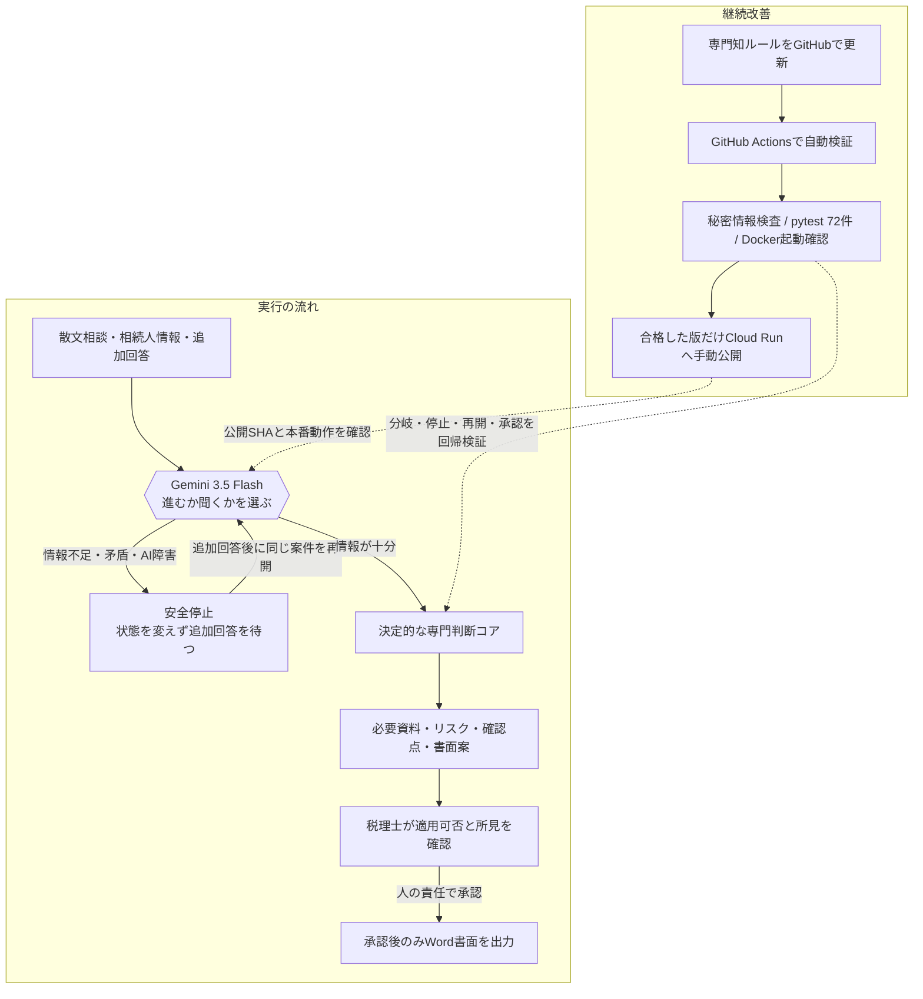

# ProtoPedia 最終差し替え原稿

主題: **DevOps for Expertise — 専門判断をDevOpsする**

この原稿は、公開デモへ最新実装を反映し、同一SHAのCIと本番確認が完了した後に差し替える。

## タイトル

```text
相続の盾｜専門判断をDevOpsするAIエージェント
```

## 概要（100字）

```text
曖昧な相続相談をGeminiが「進む／聞く」に分岐。情報不足なら状態を変えず停止し、回答後に再開。テスト済みの決定的コアと税理士承認で、専門判断を検証・更新できる運用資産へ変えるAIエージェントです。
```

## 扉画像に載せるコピー

```text
DEVOPS × AI AGENT

専門判断をDevOpsする

曖昧さはAI｜正しさはコード｜責任は人

ASK → SAFE STOP → RESUME
72 TESTS / HUMAN APPROVAL

Souzoku Shield — 相続の盾
```

扉画像では税務用語や5,600万円を主見出しにしない。主役は「専門判断をDevOpsする」というハッカソンへの回答とし、プロダクト画面のGemini実行トレースを実装証拠として添える。`SAFE STOP → 追加回答 → 再開`は2枚目で大きく説明する。

## 画像差し替え順

作品画像はすべて1024×576で統一し、次の順番で登録する。

1. `docs/protopedia_assets/01_hero.png` — 扉画像。「専門判断をDevOpsする」を最初に伝える。
2. `docs/protopedia_assets/02_agent_safe_stop.png` — AI Agentである必然性。問い返し・状態不変停止・再開。
3. `docs/protopedia_assets/03_responsibility_model.png` — AI、決定的コード、人間の責任分界とCIの具体例。
4. 最新SHAの本番で撮影した`SAFE STOP → 再開`実画面 — 実装証拠。デプロイ後に追加する。

「システム構成」欄には`docs/protopedia_assets/04_system_architecture.png`を登録する。編集可能な元データは`docs/protopedia_assets/souzoku_shield_protopedia_visuals.pptx`。

## システム構成図に載せる内容

1枚の図を、上段の**実行の流れ**と下段の**継続改善**の2レーンで構成する。固有技術名以外は日本語で説明し、審査員が図だけを見ても責任分界と安全停止を理解できるようにする。



図の色分けは、**AI＝紫、決定的コード＝緑、人間＝橙、安全停止＝琥珀、継続改善＝緑**とする。図だけを見ても「AIが全部決めるシステムではない」と分かることを優先する。

## システム構成の説明文

### 全体像

Souzoku Shieldは、散文で始まる相続相談を、検証可能な専門ワークフローへ変換します。

Gemini 3.5 Flashには2つのFunctionを公開しています。情報が足りなければ`request_clarification`を選び、案件状態を変えずに停止。十分なら`select_taker_branch`で取得者ルートを選択します。追加回答後は元の相談を引き継いで再開し、`問い返し → 停止 → 再開 → 分岐`の履歴を画面に残します。

分岐後は、Pythonの決定的コアが不足資料、リスク、確認タスク、書面添付ドラフトを同じ入力から同じ結果として組み立てます。Geminiには適用可否や総合所見を書かせません。Reviewで必ず停止し、税理士が内容を確認・承認した後だけWordを出力します。

### AIが失敗したときも、推測して進めない

Gemini APIキーがない場合やAPI・SDK障害時は、決定的な安全ガードへフォールバックします。登録カードや相談文の明示事実だけで安全に分岐できる場合は継続し、情報不足、取得者未定、居住事実の矛盾がある場合は既定値を選ばず、状態不変で安全停止します。

### 専門判断を「まわす」

GitHub Actionsはpushごとに、秘密情報スキャン、pytest 72件、Docker build、起動したコンテナの`/api/health`確認を実行します。テスト対象は結果だけでなく、問い返し、状態不変停止、未定・矛盾時の停止、回答後の再開、承認前のWord遮断、セッション分離まで含みます。

本作でDevOpsする対象は、アプリのデプロイだけではありません。専門家の暗黙知を決定的ルールとテストにし、変更のたびに壊れていないことを検証できる状態にします。

## ストーリー本文

# コードはCIで守る。専門判断は、誰が守るのか

本番コードにはテストとレビューがあります。一方、専門家の判断は、今も担当者の記憶、経験、手作業のチェックリストに大きく依存しています。

相続の案件は、専門家が一件ずつ精査すれば解けます。難しいのは、取得者、同居状況、配偶者の有無などで変わる分岐を、忙しい実務の中で一件も落とさず、担当者が変わっても同じ品質で再現し続けることです。

公開デモの架空ケースでは、自宅の取得者ルートを取り違えると課税価格への影響は5,600万円になります。これは税額ではなく、たった一つの分岐ミスが後工程全体を変えることを示すデモ値です。

**Souzoku Shieldは、この専門判断そのものをDevOpsします。**

## なぜフォームでも、回答チャットでもないのか

実際の相談は、必要項目がすべて埋まったフォームではなく、表現の揺れや事実不足を含む散文で始まります。固定フォームでは、利用者が最初から「何を確認すべきか」を知っていなければなりません。回答チャットに結論を求めれば、不足事実を推測して先へ進む危険があります。

そこでGeminiの役割を、答えを書くことではなく**次の行動を選ぶこと**に限定しました。

- 情報が足りない: `request_clarification`で問い返す
- 情報が十分: `select_taker_branch`で取得者ルートを選ぶ

自然文の曖昧さを読み、案件の状況に応じて「進むか、聞くか」を選び、ワークフローを止めたり再開したりする。ここにAIエージェントを使う必然性があります。

## 不足なら、何も変えずに止まる

曖昧な相談に対して、エージェントは適当な既定値を選びません。追加質問を表示し、案件、相続人カード、不足資料、書面ドラフトを変更せず`SAFE STOP`します。Review、承認、Word出力もロックされたままです。

税理士が追加回答を入力すると、元の相談を引き継いで処理を再開します。画面には`request_clarification → select_taker_branch`の判断履歴、使用モデル、Function名、結果、latency、fallbackの有無が残ります。

「分からないときに、分かったふりをしない」。高い責任が伴う専門領域で、最初に実装すべきエージェント能力だと考えました。

## 曖昧さの後は、決定的に処理する

取得者ルートが決まった後は、テスト済みの決定的コアが処理します。

- 不足資料
- 適用上のリスク
- 次に確認するタスク
- 書面添付ドラフト

これらを同じ事実から再現可能に導出します。5,600万円の影響につながる分岐もテスト対象です。生成AIの出力ゆらぎに、専門領域の正しさを預けません。

Geminiに障害があっても、安全に確定できる明示事実がなければ停止します。可用性のために誤ったルートを選ぶのではなく、**正しく止まることも品質**として扱います。

## 最後の判断と責任は、人に残す

システムはReviewで必ず停止します。総合所見はAIが生成せず、税理士が画面上で入力します。適用可否、最終記載、署名、提出を判断するのも税理士です。

承認前はWordを出力できません。税理士がアラート、不足資料、ドラフトを確認し、レビュー完了を承認した後だけ`.docx`が解放されます。

**曖昧さはAI、正しさはコード、責任は人へ。**

自動化で専門家を置き換えるのではなく、専門家が判断できる状態を、毎回同じ品質でつくるための責任分界です。

## DevOps × AI Agentへの回答

- **つくる**: GeminiのFunction Callingと決定的コアを責務分離する
- **まわす**: 専門分岐、安全停止、再開、承認境界を72件のテストとCIで守る
- **とどける**: Cloud Runで公開し、人の承認後だけ実務形式のWordへ届ける

本作が運用資産に変えるのは、単なるプロンプトではありません。専門家が「どの事実を確認し、どこで止まり、何を人が決めるか」という判断プロセスです。

## 公開デモで確認できること

1. 「曖昧な相談を試す」を選び、AIエージェントを実行する。
2. Geminiが`request_clarification`を選び、`状態変更なしで停止`することを確認する。
3. 追加回答を入力して再開し、判断履歴が`request_clarification → select_taker_branch`になることを確認する。
4. 決定的コアが不足資料、リスク、確認タスク、書面ドラフトを組み立てる様子を見る。
5. 税理士のレビュー完了前はWord出力できず、承認後だけ出力できることを確認する。

実行トレースでは、`model / tool / result / latency / fallback`を確認できます。GitHubでは、秘密情報スキャン、pytest、Docker build、コンテナhealth checkを含むCIを公開しています。

## 公開デモの範囲

本作は、架空データだけを扱うハッカソンM1です。実名、住所、マイナンバー、実案件情報は入力しないでください。相談文はGemini APIへ送信されます。

現時点では、登記事項証明書のOCR、登記名義の自動照合、実顧客データの保存、本人認証、永続監査ログ、税額の最終計算、申告書提出には対応していません。状態は訪問者ごとにセッション分離された一時メモリで、インスタンス再起動時に初期化されます。

## 技術スタック

- FastAPI / Python 3.13
- Gemini 3.5 Flash / Function Calling / `google-genai==2.10.0`
- GitHub Actions / pytest / Docker
- Cloud Run / Secret Manager
- python-docx

## 関連リンク

- 公開デモ: https://souzoku-agent-698253423667.asia-northeast1.run.app/
- GitHub: https://github.com/souzoku-lab/souzoku-shield
- 60秒動画: 公開後にYouTube URLを追加

## 公開直前チェック

- 最新コードをCloud Runへデプロイし、`/api/health`のversionがGitHubの提出SHAと一致している。
- 実Geminiで`request_clarification → select_taker_branch`がfallbackなしで成功している。
- 72件のpytest、Docker build、container health checkを含むCIが提出SHAで成功している。
- 扉画像、システム構成図、スクリーンショット、60秒動画が最新UIで統一されている。
- 動画URLを登録した後、公開直前に`findy_hackathon`タグを追加する。
