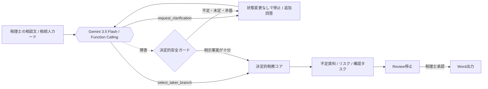

# ProtoPedia 全面差し替え原稿

## タイトル

Souzoku Shield - 相続の盾

## キャッチコピー

専門判断を、検証・承認・更新できる運用資産へ。曖昧さはAI、正しさはコード、責任は人が担う「DevOps for Expertise」。

## 概要

相続税の小規模宅地等の特例は、同じ自宅でも「誰が取得するか」「同居していたか」「配偶者や同居親族がいるか」で確認ルートが変わります。取得者区分を取り違えると、このデモの架空値では課税価格に5,600万円の差が出ます。

専門家でも、案件ごとに異なる条件分岐を、記憶と手作業だけで漏れなく、同じ品質で、制度変更後も再現し続けるのは困難です。Souzoku Shieldは、その専門判断をDevOpsします。

Geminiは未定型の相談文を読み、情報が足りなければ案件を変更せず問い返して停止。十分なら取得者ルートをFunction Callingで選びます。決定的ワークフローが不足資料・リスク・確認タスク・書面添付ドラフトを組み立て、最後は税理士の承認後だけWordを出力します。

## 何がAIエージェントなのか

Geminiの役割は、自然文から「進めるだけの情報があるか」を判断することです。不足なら`request_clarification`で問い返し、十分なら`select_taker_branch`で取得者区分を選びます。回答後は元相談を引き継いで再開し、停止→再開の判断履歴を画面に残します。

Gemini障害時も、曖昧な入力を既定値で進めません。登録カードや明示事実だけで分岐できる場合は決定的処理で継続し、情報不足・取得者未定・居住事実の矛盾があれば状態不変で安全停止します。

決定的コアの役割は、税務要件、資料、課税価格への影響、ドラフトを再現可能に導出することです。AIに税務判断や総合所見を書かせません。

税理士の役割は、適用可否、最終記載、署名、提出を判断することです。システムはReviewで停止し、人の承認後だけWord出力を許可します。

## Runtime構成

## DevOps構成

## デモで確認できること

- 相続人カードを登録し、自宅取得者をクリックで選べる。
- 登録した相続人の関係性・同居区分を修正し、誤登録したカードを削除できる。
- 相談文なしでも相続人カードだけでReview作成できる。
- 曖昧な相談では、Geminiが`request_clarification`を選び、案件状態を変えず停止する。
- 追加回答後は同じ相談を再開し、`select_taker_branch`で取得者区分を選ぶ。
- 2回の判断、状態変更の有無、fallback、latencyを実行トレースで確認できる。
- 同居親族や配偶者がいるのに別居親族が自宅を取得する場合、適用不可アラートを出す。
- 否認インパクトは税額ではなく、課税価格への影響`+56,000,000円`として表示する。
- 配偶者取得では二次相続の検討アラートを出す。
- 総合所見はAIが書かず、税理士が画面上で入力する。
- 承認前はWord出力不可、承認後のみWord出力可能。

## 公開デモの安全性

- 公開用の架空デモです。実名、住所、マイナンバー、実案件情報は入力しないでください。
- 相談文はGemini APIへ送信されます。
- 状態は訪問者間でセッション分離されます。インスタンス再起動時には初期化される一時状態です。
- CORSは開放していません。
- 相談文は8〜1200文字、AI実行は2秒cooldown・1セッション20回までです。
- Gemini APIキーはSecret Managerで管理し、GitHubには含めません。

## 未実装のもの

- 登記事項証明書のOCR。
- 登記名義の自動照合。
- 実顧客データの保存。
- 本人認証。
- 永続監査ログ。
- Firestore等の永続DB。
- 税額の最終計算や申告書提出。

## 技術スタック

- FastAPI
- Python 3.13
- Gemini API / `google-genai==2.10.0`
- GitHub Actions CI
- Docker
- Cloud Run
- python-docx

## 審査員向け確認ポイント

1. Cloud Run公開URLを開く。
2. 個人情報警告を確認する。
3. 「曖昧な相談を試す」からAIエージェントを実行する。
4. `request_clarification`、追加情報待ち、`状態変更なしで停止`を確認する。
5. 回答を追加して再開し、判断履歴が`request_clarification → select_taker_branch`、`fallbackなし`になることを確認する。
6. 課税価格`+56,000,000円`のアラートを確認する。
7. 総合所見を手入力し、レビュー完了（承認）する。
8. 承認後だけWord出力できることを確認する。
9. GitHub Actions CIでsecret scan、pytest、Docker build、container health smokeが通っていることを確認する。
